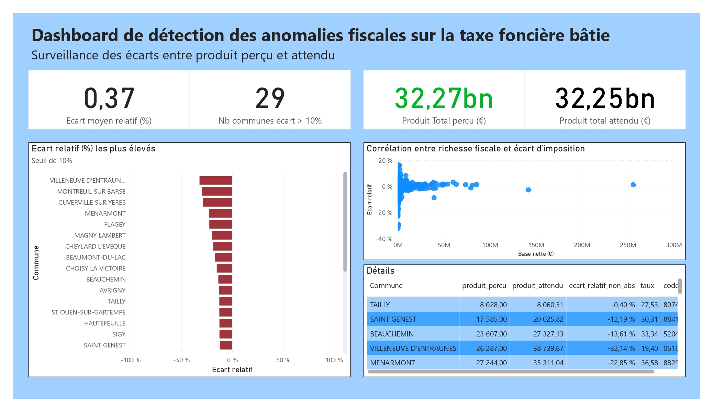

# Analyse des écarts fiscaux sur la taxe foncière des propriétés bâties (TFPB) - France 2021

Ce projet a été réalisé dans le cadre d'une candidature à un poste d'analyste BI dans le secteur public.  
Il a pour objectif de détecter des écarts anormaux entre le produit perçu et le produit attendu sur la taxe foncière sur les propriétés bâties (TFPB), à partir des données ouvertes officiel.

Le but est de montrer rapidement ma compréhension du rôle d'analyste en démontrant ma capacité à préparer, transformer et analyser des données fiscales dans un objectif d’aide à la décision.

## Résultat

>**Interprétation :**  
>L’analyse révèle que le modèle fiscal est plutôt stable : au niveau national, les écarts entre le produit réel et le produit attendu restent globalement faibles, ce qui indique que l’État collecte correctement la taxe foncière bâtie. En revanche, ces écarts importants sont plus fréquents dans les petites communes, où la base fiscale est plus restreinte. Quelques cas isolés montrent des différences marquées, ce qui pourrait justifier un contrôle plus approfondi ou une vérification manuelle.

## Contenu du projet

- Analyse fonctionnelles des besoins utilisateurs 
- Préparation des données : nettoyage, calcul du produit attendu, calcul des écarts relatifs
- Modélisation d’un schéma décisionnel pour une architecture de data warehouse
- Conception d’un dashboard Power BI incluant :
  - 4 indicateurs clés (KPI)
  - Un histogramme des 10 communes avec les plus grands écarts signés
  - Un scatter plot montrant la relation entre base nette et écart absolu
  - Une table de détails par commune

## Organisation du dépôt

- `etl/` : données traitées par l'ETL et implementation de cette dernière
- `powerbi/` : fichier Power BI final (.pbix)
- `docs/` : analyse fonctionnelle et modélisation
- `data/` : sources de données utilisées

## Stack utilisée

- Python (Jupyter Notebook) + DuckDB pour le traitement des données
- Power BI pour la visualisation
- Modélisation en étoile (Fact + Dimensions)
