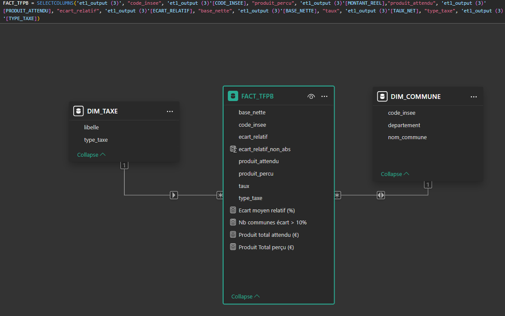

# Modélisation des données – Projet TFPB

## 1. Objectif de la modélisation

Dans ce projet, l’objectif était de structurer les données de manière simple pour permettre une analyse efficace dans Power BI.  
Nous avons donc construit un modèle décisionnel qui permet d'extraire les indicateurs clés sur la taxe foncière bâtie (TFPB), et de faciliter l'exploration visuelle par les utilisateurs.

## 2. Approche choisie

Pour des raisons de simplicité et parce qu’il s’agit d’un projet personnel, nous n’avons pas utilisé un vrai data warehouse.  
La modélisation a été réalisée directement dans Power BI à partir du fichier CSV obtenu après l'éxecution de l'ETL.

Cependant, nous avons quand même respecté les principes de la modélisation d’un entrepôt de données, en mettant en place un **modèle en étoile**.

Le modèle en étoile est simple à comprendre et bien adapté aux outils de BI. 
Il sépare les données **quantitatives** (mesures) dans une table de faits, et les **données descriptives** (contextuelles) dans des tables de dimensions.  
Cela facilite la navigation, les filtres, les agrégations, et permet d’étendre le modèle plus facilement par la suite.

## 4. Tables du modèle

### Table de faits : `Fact_TFPB`

Cette table contient les mesures calculées à analyser, pour chaque commune.
Chaque ligne correspond à une commune pour l'année 2021.

### Table de dimension : `Dim_Commune`

Cette table décrit chaque commune.
Cela permet de filtrer ou regrouper les résultats par territoire.

### Table de dimension : `Dim_Taxe`

Même si nous n’avons travaillé que sur la TFPB, cette dimension a été ajoutée pour montrer que le modèle peut évoluer.  